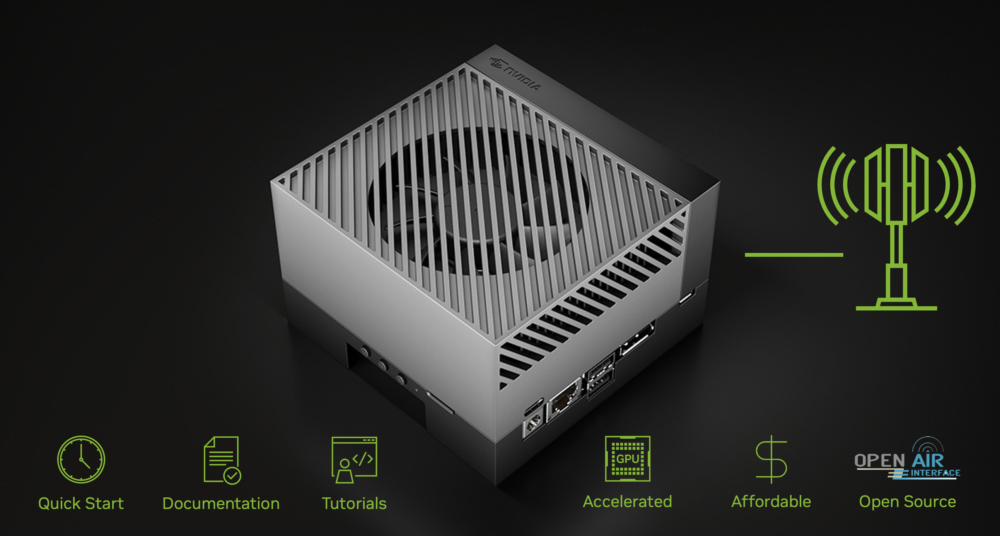

=================
Research Kit (RK)
=================
.. include:: <isonum.txt>

The `Sionna Research Kit <https://github.com/NVlabs/sionna-rk>`_ is an accelerated, open platform for wireless research and development. Powered by the `NVIDIA DGX Spark <https://www.nvidia.com/en-us/products/workstations/dgx-spark/>`_ and built on `OpenAirInterface <https://openairinterface.org>`_, it provides a software-defined 5G RAN and core network for end-to-end experimentation running in real-time.

Created by the team behind `Sionna <https://github.com/NVlabs/sionna>`_, it features textbook-quality tutorials and `O-RAN <https://www.o-ran.org/>`_-compliant interfaces. In just one afternoon, you will connect commercial 5G equipment to a network using your own customizable transceiver algorithms. Conducting `AI-RAN <https://ai-ran.org/>`_ experiments, whether simulated, cabled, or over-the-air, has never been more accessible.

|

.. rubric:: Democratizing AI-RAN Research

The Sionna Research Kit is not just another testbed—it is an open platform that enables you to accelerate AI, ML, signal processing, and ray tracing with the ease of a unified memory architecture. You can inspect, modify, and accelerate the whole telecommunications software stack across layers. With its low barrier to entry, it is excellent for onboarding and educating the next generation of telecommunications engineers. Based on open-source software, researchers across academia and industry can develop and test new algorithms within a real-world 5G NR system and beyond.

.. rubric:: Hardware

We recommend the `NVIDIA DGX Spark <https://www.nvidia.com/en-us/products/workstations/dgx-spark/>`_ and `USRPs from Ettus Research <https://www.ettus.com/products/>`_ which are commonly used at universities and research institutions. Refer to the :ref:`bom` for more details.

The DGX Spark platform is ideal for experimenting with AI acceleration and deploying novel AI-RAN algorithms. Even the code and tutorials of the Sionna Research Kit have been developed on the DGX Spark platform.

.. rubric:: Table of Contents

.. toctree::
   :maxdepth: 2

   quickstart
   setup
   tutorials
   Get the Code <https://github.com/NVlabs/sionna-rk>

.. rubric:: License and Citation

The software available under this repository is governed by the Apache 2.0 license as found in the `LICENSE <https://github.com/NVlabs/sionna-rk/blob/main/LICENSE>`_ file.

In connection with your use of this software, you may receive links to third-party technology, and your use of third-party technology may be subject to third-party terms, privacy statements or practices. NVIDIA is not responsible for the terms, privacy statements or practices of third parties. You acknowledge and agree that it is your sole responsibility to obtain any additional third-party licenses required to make, have made, use, have used, sell, import, and offer for sale products or services that include or incorporate any third-party technology. NVIDIA does not grant to you under the project license any necessary patent or other rights, including standard essential patent rights, with respect to any such third-party technology.

If you use this software, please cite it as:

.. code:: bibtex

   @software{sionna-rk,
    title = {Sionna Research Kit},
    author = {Cammerer, Sebastian, and Marcus, Guillermo and Zirr, Tobias and Hoydis, Jakob and {Ait Aoudia}, Fayçal and Wiesmayr, Reinhard and Maggi, Lorenzo and Nimier-David, Merlin and Keller, Alexander},
    note = {https://nvlabs.github.io/sionna/rk/index.html},
    year = {2025},
    version = {1.1.0}
   }
