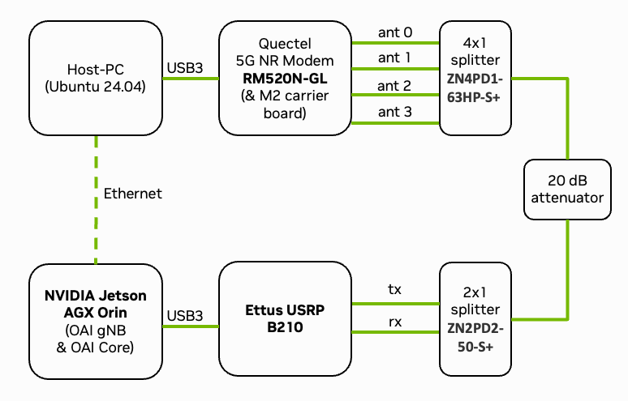
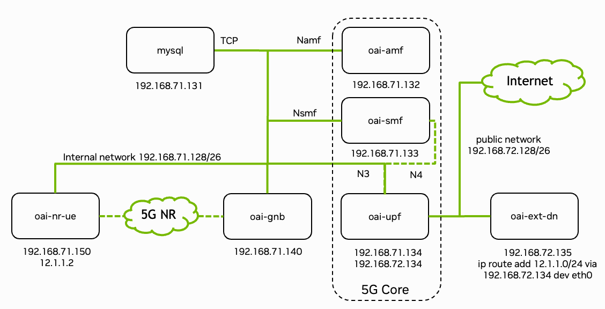

.. _quickstart:

Quickstart
==========

By following this guide, you can set up your private software-defined 5G network in an afternoon using the Sionna Research Kit. The system allows you to connect commercial off-the-shelf (COTS) user equipment (UE), either via cable or over-the-air.

.. warning::
    Ensure compliance with local RF spectrum regulations before conducting over-the-air experiments.

.. note::
   If you have your DGX Spark (DGX OS 7.3 or later) or Jetson (Jetpack R36.3 or later) system ready and if you are experienced with OAI, the shortest path to get started is:

   .. code-block:: bash

      # Checkout the Github repository
      git clone --recurse-submodules https://github.com/NVlabs/sionna-rk.git
      cd sionna-rk

      # Prepare system
      make prepare-system

      # Reboot
      sudo reboot

      # Build Sionna RK images and config
      make sionna-rk

      # You can now start the end-to-end system in the rf-simulator mode
      ./scripts/start_system.sh rfsim

      # Or connect your USRP and run real transmissions.
      # Note that you need to modify the .env file in the
      # config/b200/ directory to set your USRP serial number
      ./scripts/start_system.sh b200

What follows is a more detailed sequence of steps, including hardware configuration details.

Hardware Requirements
---------------------

.. _figure_system_setup:

   Overview of the deployed setup. See `Ettus OAI reference architecture <https://kb.ettus.com/OAI_Reference_Architecture_for_5G_and_6G_Research_with_USRP>`_ for details.

:numref:`figure_system_setup` shows the setup of the Sionna Research Kit consisting of a USRP, a Quectel modem, and a DGX Spark. In the following, we will guide you through the steps to setup the system. The following components are required to run the Sionna Research Kit. Please refer to the :ref:`bom` for detailed specifications:

* `NVIDIA DGX Spark <https://www.nvidia.com/en-us/products/workstations/dgx-spark/>`_
* `Ettus USRP B210/B206mini <https://www.ettus.com/product-categories/usrp-bus-series/>`_
* `Quectel RM520N-GLAA module <https://www.quectel.com/product/5g-rm520n-series/>`_ connected to a host PC
* `Programmable SIM cards <https://open-cells.com/index.php/sim-cards/>`_
* RF cables, splitters/combiners, attenuators, and/or antennas

Connect the components as shown in :numref:`figure_system_setup`.
This means that the DGX Spark is connected to the USRP and the Quectel modem is connected to the host machine. Connect the UE and the USRP via RF cables and corresponding splitters/combiners. Note that an attenuator in-between the USRP and the UE is strongly recommended to protect the USRP from high power levels.

Step 1: DGX Spark Setup
-----------------------

For DGX Spark, you need to install the latest DGX OS (7.3 or later).

If you want to run the Research Kit on the Jetson platform, please refer to the :ref:`jetson_orin` or :ref:`jetson_thor` setup guide.

Install the prerequisites:

.. code-block:: bash

   sudo apt update
   sudo apt install -y git

Clone the repository:

.. code-block:: bash

   git clone --recurse-submodules https://github.com/NVlabs/sionna-rk.git
   cd sionna-rk

.. note::
   The following steps can also be executed via:

   .. code-block:: bash

      make prepare-system

Configure the system:

.. code-block:: bash

   ./scripts/configure-system.sh
   sudo reboot

For testing and development, create a virtual environment and install Python packages:

.. code-block:: bash

   python3 -m venv env
   source env/bin/activate
   pip install -r requirements.txt

   # pip install -r requirements_thor.txt for Thor
   # pip install -r requirements_orin.txt for Orin

[TODO] Add export lines for TensorRT

Step 2: USRP Setup
------------------

Install UHD drivers and verify the USRP connection:

.. code-block:: bash

   # Run install script
   ./scripts/install-usrp.sh

   # Verify connection
   uhd_find_devices
   uhd_usrp_probe

.. note::
    Make note of your USRP's serial number - you'll need it later for configuration.

.. note::
   Sometimes OAI gets confused if the USRP firmware is not loaded. In that case, run one of the uhd utilities to load the default firmware in the device, and retry.

Step 3: UE Setup
----------------

The next step is the :ref:`sim`.
Connect the SIM card programmer, download the ``program_uicc`` tool from `here <https://open-cells.com/index.php/sim-cards/>`_ and run the following commands:

.. code-block:: bash

   # Note that the IMSI must be registered in config/common/oai_db.sql
   # numbers below are already pre-registered in the OAI database
   sudo ./program_uicc --adm 12345678 --imsi 262990100016069 \
       --key fec86ba6eb707ed08905757b1bb44b8f \
       --opc C42449363BBAD02B66D16BC975D77CC1

Insert SIM card into the Quectel modem and configure the modem on the host machine (see :ref:`quectel`):

.. code-block:: bash

   sudo mmcli -m 0 --enable
   sudo nmcli c add type gsm ifname cdc-wdm0 con-name oai apn oai connection.autoconnect yes

Step 4: Deploy 5G Stack
-----------------------

.. _figure_5g_stack:

   Overview of the deployed 5G end-to-end stack with IP adresses and interfaces of each container. Figure from `OpenAirInterface <https://gitlab.eurecom.fr/oai/openairinterface5g/-/blob/develop/ci-scripts/yaml_files/5g_rfsimulator/README.md#2-deploy-containers>`_.

:numref:`figure_5g_stack` shows the block diagram of the complete system (see `OpenAirInterface5G guide <https://gitlab.eurecom.fr/oai/openairinterface5g/-/blob/develop/ci-scripts/yaml_files/5g_rfsimulator/README.md#2-deploy-containers>`_ for more details). The 5G stack is deployed via Docker containers. The following steps build and deploy the core network components and the RAN components:

.. note::
   The following steps can also be executed via:

   .. code-block:: bash

      make sionna-rk

.. code-block:: bash

   # Pull, patch and build OAI containers
   ./scripts/quickstart-oai.sh

   # Generate config files
   ./scripts/generate-configs.sh

   # Build plugins specific components (e.g., TRT engines)
   ./plugins/common/build_all_plugins.sh --host
   ./plugins/common/build_all_plugins.sh --container

The system can be configured via environment variables. You can configure the system by editing the `.env` file in the `config/b200/` or `config/rfsim/` directory, respectively.

Edit `config/b200/.env` and set the following parameters:

   * Set your USRP serial number
   * Select the configuration file for desired number of PRBs (default is 24, equals 8.64MHz bandwidth)

And finally, you can start the system:

.. code-block:: bash

   # For real hardware setup using the USRP
   ./scripts/start_system.sh b200

   # Or for RF simulations without using real hardware
   ./scripts/start_system.sh rfsim

Monitor the system:

.. code-block:: bash

   # Show running containers
   docker ps -a

   # View gNB logs
   docker logs -f oai-gnb

The docker containers should be all in a "healthy" state and the gNB log should
indicate that the UE is successfully connected (``in-sync``).

Have Your First Call
--------------------

Congratulations, your system is now running and ready for your own experiments!

Verify connectivity on the host machine (using the Quectel modem):

.. code-block:: bash

   # Check connection status
   nmcli connection show

   # Check that ip address is assigned to wwan0
   ip addr show wwan0

   # Test internet connectivity through the 5G tunnel
   ping -I wwan0 google.com

This has been successfully tested on Raspberry Pi OS, for other distributions the Quectel QConnectManager might need to be installed manually.

Monitor system load:

.. code-block:: bash

   # On DGX Spark
   nvtop

   # On Jetson
   jtop

And run performance tests:

.. code-block:: bash

   # If not already running, start iperf3 server in Docker container
   docker exec -d oai-ext-dn iperf3 -s

   # On the client (UE); you need to install iperf3 on the host machine
   # Downlink test
   iperf3 -u -t 10 -i 1 -b 1M -B 12.1.1.2 -c 192.168.72.135 -R

   # Uplink test
   iperf3 -u -t 10 -i 1 -b 1M -B 12.1.1.2 -c 192.168.72.135

   # Change 1M to the desired throughput in Mbit/s

You can now have your first call over your private 5G network!

We hope that you have enjoyed this quickstart guide! For inspiration and as blueprint for your own experiments, you can now try the following precompiled tutorials:

* Explore the :ref:`accelerated_ldpc` tutorial and learn about accelerated RAN
* Learn about :ref:`data_acquisition` to generate training data for your own AI models
* Discover the toolchain from training in Sionna to the :ref:`neural_demapper` in a real 5G network
* Run a :ref:`ue_emulator`
* Replace classical receiver signal processing with a neural network in the :ref:`neural_receiver` tutorial

Check the :ref:`tutorials` page for more info.

For a detailed configuration and troubleshooting, see the :ref:`setup` guide or visit the `Github Discussions <https://github.com/NVLabs/sionna/discussions>`_.
