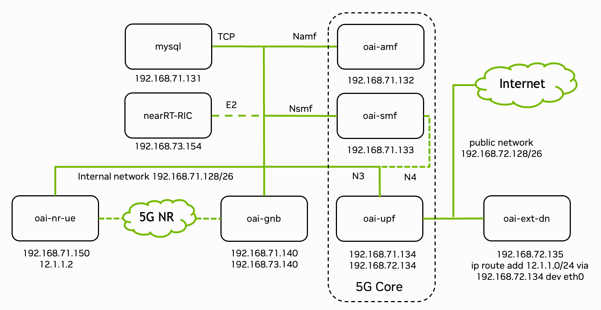

.. _OAI:

OpenAirInterface Setup
======================

.. _fig_5g_stack:

   Overview of the deployed 5G end-to-end stack. Figure from `OpenAirInterface <https://gitlab.eurecom.fr/oai/openairinterface5g/-/blob/develop/ci-scripts/yaml_files/5g_rfsimulator/README.md>`_.

The 5G stack is deployed as Docker containers. :numref:`fig_5g_stack` shows the system architecture with network interfaces and IP addresses.

The Sionna Research Kit builds GPU-accelerated (CUDA) images for:

* ``oai-gnb-cuda`` - gNodeB with GPU acceleration
* ``oai-nr-ue-cuda`` - 5G NR UE with GPU acceleration
* ``oai-flexric`` - FlexRIC for O-RAN support

The 5G Core Network uses `pre-built images from Docker Hub <https://hub.docker.com/u/oaisoftwarealliance>`_.

For further details, see the `OpenAirInterface Documentation <https://openairinterface-docs-5b3d70.eurecom.io/>`_.

.. note::
   The following steps can also be executed via:

   .. code-block:: bash

      make sionna-rk

   Or individually with the following commands:

   .. code-block:: bash

      # Pull, patch and build OAI containers
      ./scripts/quickstart-oai.sh

      # Generate configuration files
      ./scripts/generate-configs.sh

      # Build plugin components (TensorRT engines, etc.)
      ./plugins/common/build_all_plugins.sh --host
      ./plugins/common/build_all_plugins.sh --container

Manual Build Steps
------------------

For development or debugging, the individual steps are documented below.

Clone the OAI repository:

.. code-block:: bash

   git clone --recurse-submodules --branch 2025.w34 https://gitlab.eurecom.fr/oai/openairinterface5g.git ext/openairinterface5g

Apply the Sionna Research Kit patches:

.. code-block:: bash

   cd ext/openairinterface5g
   git apply --index < ../../patches/openairinterface5g.patch

These patches enable GPU acceleration and contai the plugin infrastructure for the Sionna Research Kit.

Run the docker builds individually:

.. code-block:: bash

   cd ext/openairinterface5g

   # Base image
   docker build --target ran-base-cuda --tag ran-base-cuda:latest \
       --file docker/Dockerfile.base.ubuntu.cuda .

   # Build image (run from sionna-rk root to include plugins)
   cd ../..
   docker build --target ran-build-cuda --tag ran-build-cuda:latest \
       --file ext/openairinterface5g/docker/Dockerfile.build.ubuntu.cuda .

   cd ext/openairinterface5g

   # gNodeB
   docker build --target oai-gnb-cuda --tag oai-gnb-cuda:latest \
       --file docker/Dockerfile.gNB.ubuntu.cuda .

   # UE
   docker build --target oai-nr-ue-cuda --tag oai-nr-ue-cuda:latest \
       --file docker/Dockerfile.nrUE.ubuntu.cuda .

   # FlexRIC
   docker build --target oai-flexric-fixed --tag oai-flexric:latest \
       --file docker/Dockerfile.flexric.ubuntu .

Note that ``ran-build-cuda`` must be built from the Sionna Research Kit root directory so that plugins are included in the build context.

Check that all images were built successfully:

.. code-block:: bash

   docker images

   REPOSITORY        TAG      SIZE
   ran-base-cuda     latest   17.2GB
   ran-build-cuda    latest   21.9GB
   oai-gnb-cuda      latest   16.4GB
   oai-nr-ue-cuda    latest    8.1GB
   oai-flexric       latest    1.1GB

Build Plugins
-------------

Some plugins must be built on the specific platform. For example, the TensorRT engines are target specific:

.. code-block:: bash

   ./plugins/common/build_all_plugins.sh --host
   ./plugins/common/build_all_plugins.sh --container

