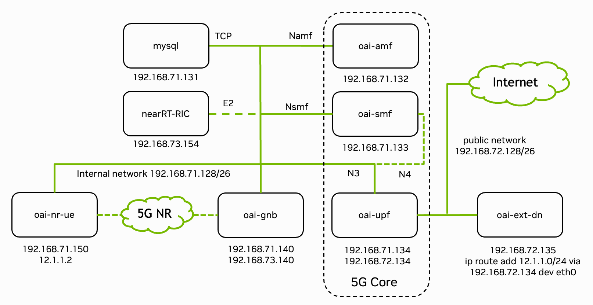

.. _OAI:

OpenAirInterface Setup
======================

.. _fig_5g_stack:

   Overview of the deployed 5G end-to-end stack. Figure from `OpenAirInterface <https://gitlab.eurecom.fr/oai/openairinterface5g/-/blob/develop/ci-scripts/yaml_files/5g_rfsimulator/README.md>`_.

The 5G stack is deployed as Docker containers. :numref:`fig_5g_stack` shows the system architecture with network interfaces and IP addresses.

The Sionna Research Kit builds GPU-accelerated (CUDA) images for:

* ``oai-gnb-cuda`` - gNodeB with GPU acceleration
* ``oai-nr-ue-cuda`` - 5G NR UE with GPU acceleration
* ``oai-flexric`` - FlexRIC for O-RAN support

The 5G Core Network uses `pre-built images from Docker Hub <https://hub.docker.com/u/oaisoftwarealliance>`_.

For further details, see the `OpenAirInterface Documentation <https://openairinterface-docs-5b3d70.eurecom.io/>`_.

.. note::
   The following steps can also be executed via:

   .. code-block:: bash

      make sionna-rk

   Or individually with the following commands:

   .. code-block:: bash

      # Pull, patch and build OAI containers
      ./scripts/quickstart-oai.sh

      # Generate configuration files
      ./scripts/generate-configs.sh

      # Build plugin components (TensorRT engines, etc.)
      ./plugins/common/build_all_plugins.sh --host
      ./plugins/common/build_all_plugins.sh --container
   
   Subsequent builds can be invoked with:

   .. code-block:: bash

      ./scripts/build-oai-images.sh --tag latest ./ext/openairinterface5g

Manual Build Steps
------------------

For development or debugging, the individual steps are documented below.

Clone the OAI repository (without submodules initially):

.. code-block:: bash

   git clone --branch 2025.w34 https://gitlab.eurecom.fr/oai/openairinterface5g.git ext/openairinterface5g

Apply the Sionna Research Kit patches:

.. code-block:: bash

   cd ext/openairinterface5g
   git apply --index < ../../patches/openairinterface5g.patch

These patches enable GPU acceleration and the plugin infrastructure for the Sionna Research Kit.

Initialize the submodules:

.. code-block:: bash

   cd ext/openairinterface5g
   git submodule update --init --recursive

Use the build script to build the images:

.. code-block:: bash

   ./scripts/build-oai-images.sh --tag latest ./ext/openairinterface5g

Or configure and run the docker builds individually:

.. code-block:: bash

   # needed only for Orin platform (AGX Orin or Orin Nano Super)
   export BASE_IMAGE="nvcr.io/nvidia/l4t-jetpack:r36.3.0"
   export BOOST_VERSION="1.74.0"
   export EXTRA_DEB_PKGS="gcc-12 g++-12"
   export BUILD_OPTION="--cmake-opt -DCMAKE_C_COMPILER=gcc-12 --cmake-opt -DCMAKE_CXX_COMPILER=g++-12 --cmake-opt -DCMAKE_CUDA_ARCHITECTURES=87 --cmake-opt -DAVX2=OFF --cmake-opt -DAVX512=OFF"
   export FLEXRIC_BUILD_OPTIONS="-DCMAKE_C_COMPILER=gcc-12 -DCMAKE_CXX_COMPILER=g++-12"
   export docker_build_opts="--build-arg BASE_IMAGE --build-arg BOOST_VERSION --build-arg EXTRA_DEB_PKGS --build-arg BUILD_OPTION --build-arg FLEXRIC_BUILD_OPTIONS"

   export oai_root=./ext/openairinterface5g

   # RAN base image
   docker build $docker_build_opts --target ran-base-cuda --tag ran-base-cuda:latest \
       --file $oai_root/docker/Dockerfile.base.ubuntu.cuda $oai_root

   # RAN build image (run from sionna-rk root to include plugins)
   docker build $docker_build_opts --target ran-build-cuda --tag ran-build-cuda:latest \
       --file $oai_root/docker/Dockerfile.build.ubuntu.cuda .

   # gNodeB
   docker build $docker_build_opts --target oai-gnb-cuda --tag oai-gnb-cuda:latest \
       --file $oai_root/docker/Dockerfile.gNB.ubuntu.cuda $oai_root

   # UE
   docker build $docker_build_opts --target oai-nr-ue-cuda --tag oai-nr-ue-cuda:latest \
       --file $oai_root/docker/Dockerfile.nrUE.ubuntu.cuda $oai_root

   # FlexRIC
   docker build $docker_build_opts --target oai-flexric-fixed --tag oai-flexric:latest \
       --file $oai_root/docker/Dockerfile.flexric.ubuntu $oai_root

Note that ``ran-build-cuda`` must be built from the Sionna Research Kit root directory so that plugins are included in the build context.

Check that all images were built successfully (image sizes do not need to match):

.. code-block:: bash

   docker images

   REPOSITORY        TAG      SIZE
   ran-base-cuda     latest   17.2GB
   ran-build-cuda    latest   21.9GB
   oai-gnb-cuda      latest   16.4GB
   oai-nr-ue-cuda    latest    8.1GB
   oai-flexric       latest    1.1GB

Build Plugins
-------------

Some plugins must be built on the specific platform. For example, the TensorRT engines are target specific:

.. code-block:: bash

   ./plugins/common/build_all_plugins.sh --host
   ./plugins/common/build_all_plugins.sh --container

