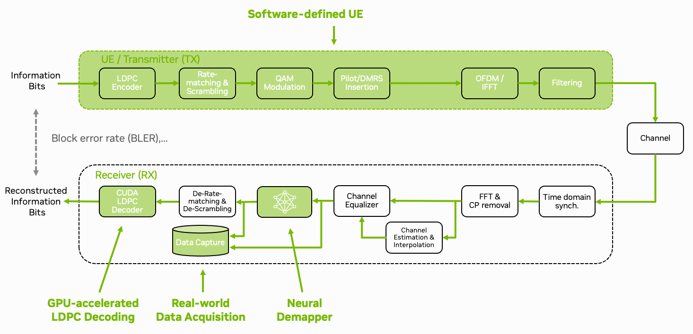

.. _tutorials:

Tutorials
=========

Deployment of AI/ML components in the physical layer of a real 5G system can be a challenging yet exciting task. The Sionna Research Kit provides a set of tutorials and code examples on how to deploy your own AI-RAN components in a real 5G network using commercial-off-the-shelf (COTS) hardware.

In a first step, the :ref:`data_acquisition` tutorial explains how to create custom plugins and capture real-world 5G signals using the Sionna Research Kit. This introduces the flexible plugin system that enables easy integration of custom code in the OAI stack.
Building on this, we show how the physical layer can be accelerated using :ref:`accelerated_ldpc`. The :ref:`neural_demapper` tutorial then explains how to train a neural network-based demapper and integrate it in the 5G stack using NVIDIA TensorRT for real-time inference.
The :ref:`neural_receiver` tutorial goes one step further and replaces the entire receiver chain (channel estimation, equalization, demapping) with a neural network.
Finally, the :ref:`ue_emulator` tutorial allows you to simulate the entire end-to-end system using software defined user equipment (UE). This allows for the evaluation of novel --- non-standard compliant --- algorithms and protocols.

All tutorials are precompiled during the quickstart setup of the system, and integrated in the compiled images. Check :ref:`run_tutorials` if you want to give them a try before going into the details.

The :ref:`ric_xapps` tutorial introduces the RAN Intelligent Controller (RIC) architecture and demonstrates how to develop xApps for intelligent network control and optimization.

Additionally, we provide a tutorial on :ref:`debugging` to help you resolve issues that may arise when working with the Sionna Research Kit.

Besides *AI for RAN*, the AI-RAN alliance also envisions the coexistence of *AI and RAN* on the same platform. Many examples of LLM deployment on the DGX Spark platform can be found in the `NVIDIA DGX Spark Playbooks <https://build.nvidia.com/spark>`_ and `NVIDIA Jetson AI Lab <https://www.jetson-ai-lab.com>`_, respectively.

.. toctree::
   :maxdepth: 1

   tutorials/run_tutorials.rst
   tutorials/data_acquisition/index.rst
   tutorials/ric_xapps/index.rst
   tutorials/ldpc_cuda/index.rst
   tutorials/neural_demapper/index.rst
   tutorials/neural_receiver/index.rst
   tutorials/ue_emulator.rst
   tutorials/debugging.rst

The best way to get started is to have a look at the :ref:`run_tutorials` section.
